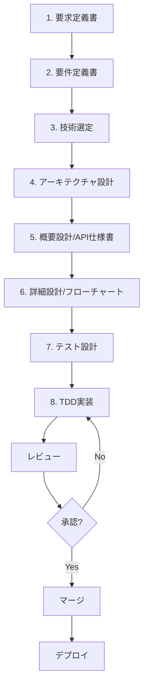

# 開発フローとレビュープロセス

## 8段階開発フロー概要



## 詳細フロー（8段階）

### 1. 要求定義書作成フェーズ
**責任者**: ボス + ステークホルダー

1. ビジネス要件の明確化
2. ユーザーストーリーの作成
3. 受け入れ基準の定義

**成果物**: 要求定義書

### 2. 要件定義書作成フェーズ
**責任者**: ボス

1. 機能要件の詳細化
2. 非機能要件の定義（性能、セキュリティ、可用性等）
3. 制約条件の確認

**成果物**: 要件定義書、プロジェクトチャーター

### 3. 技術選定フェーズ
**責任者**: エンジニア（リードエンジニア）

1. 技術スタックの決定
2. フレームワーク・ライブラリの選定
3. 開発ツールの決定

**成果物**: 技術選定書

### 4. アーキテクチャ設計フェーズ ⭐ 新追加
**責任者**: エンジニア（シニアエンジニア） + ボス承認

1. システム全体の構成設計
2. レイヤー構造の設計
3. コンポーネント間の依存関係
4. データフロー設計
5. セキュリティアーキテクチャ
6. スケーラビリティ考慮

**成果物**: アーキテクチャ設計書、システム構成図

### 5. 概要設計（API仕様書）フェーズ
**責任者**: エンジニア

1. API エンドポイント設計
2. データスキーマ設計
3. 外部システム連携仕様
4. 認証・認可方式

**成果物**: API仕様書、データモデル

### 6. 詳細設計（フローチャート）フェーズ
**責任者**: エンジニア

1. 業務フローの詳細化
2. 例外処理の設計
3. エラーハンドリング戦略
4. パフォーマンス要件の詳細

**成果物**: 詳細設計書、フローチャート

### 7. テスト設計フェーズ
**責任者**: エンジニア + ボス（承認）

1. テストケースの作成
2. 受け入れ基準の明確化
3. **テストファイルの保護開始**

**成果物**: テスト設計書、テストコード（保護済み）

### 8. TDD実装フェーズ
**責任者**: エンジニア

1. **RED-GREEN-REFACTOR**サイクル
2. **テスト修正禁止**の徹底
3. 継続的な品質チェック

**成果物**: 実装コード、実行結果レポート

### 3. タスク分割と割り当て
**責任者**: ボス

```bash
# タスクの作成
./scripts/agent-task.sh create engineer "user-authentication" "ユーザー認証機能の実装"

# タスクの確認
./scripts/agent-task.sh list
```

**ルール**:
- 1タスクは1-3日で完了可能なサイズに分割
- 依存関係を明確に定義
- 各エージェントの専門性に応じて割り当て

### 4. 実装フェーズ
**実行者**: 各エージェント

1. **環境準備**
   ```bash
   # Worktreeの作成
   ./scripts/worktree-manager.sh create feat/task-name agent-type
   ```

2. **TDD実装**
   - テスト作成
   - 実装
   - リファクタリング

3. **進捗報告**
   ```bash
   # タスク状態の更新
   ./scripts/agent-task.sh update task-id in_progress
   ```

### 5. テストフェーズ
**基準**: 
- 単体テストカバレッジ: 80%以上
- 統合テスト: 全シナリオパス
- E2Eテスト: 主要ユーザーフロー

**テスト種別**:
```javascript
// 単体テスト例（Jest + Power Assert）
import assert from 'power-assert';

describe('Authentication', () => {
  test('should validate user credentials', () => {
    const result = authenticate('user@example.com', 'password123');
    assert(result.success === true);
    assert(result.user.email === 'user@example.com');
  });
});
```

### 6. レビュープロセス

#### 自動レビュー
- CI/CDパイプラインでの自動チェック
  - Linting (ESLint, Prettier)
  - Type checking (TypeScript)
  - テスト実行
  - セキュリティスキャン

#### 手動レビュー
**レビュアー**: ボス + 関連エージェント

**チェックポイント**:
- [ ] 要件を満たしているか
- [ ] コード品質基準を満たしているか
- [ ] テストが適切か
- [ ] ドキュメントが更新されているか
- [ ] パフォーマンスへの影響
- [ ] セキュリティ考慮

**レビューコメント例**:
```markdown
## レビュー結果
- ✅ 機能要件を満たしている
- ⚠️ エラーハンドリングの改善が必要
- 💡 パフォーマンス最適化の提案あり
```

### 7. マージプロセス

1. **PR作成**
   ```bash
   # GitHub CLIを使用
   gh pr create --title "feat: ユーザー認証機能" \
     --body "実装内容の説明..." \
     --base main
   ```

2. **マージ条件**
   - 全テストがパス ✅
   - レビュー承認 ✅
   - コンフリクトなし ✅
   - ドキュメント更新 ✅

3. **マージ実行**
   ```bash
   # Squash and merge推奨
   git checkout main
   git merge --squash feat/branch-name
   git commit -m "feat: 機能説明 (#PR番号)"
   ```

## コミュニケーションルール

### 日次スタンドアップ
- 各エージェントの進捗共有
- ブロッカーの報告
- 当日の作業計画

### 週次レビュー
- 完了タスクの確認
- 次週の計画
- 振り返りと改善提案

### 緊急時の対応
1. ボスへの即時報告
2. 影響範囲の特定
3. 対応方針の決定
4. 実行と事後検証

## 品質基準

### コード品質
- 可読性: 明確な命名、適切なコメント
- 保守性: モジュール化、DRY原則
- パフォーマンス: 応答時間、リソース使用量
- セキュリティ: OWASP Top 10対策

### ドキュメント品質
- 完全性: 全機能が文書化されている
- 正確性: 実装と一致している
- 可読性: 明確で理解しやすい

### プロセス品質
- 予定遵守率: 90%以上
- 不具合密度: 1KLOC あたり1件以下
- 顧客満足度: 4.0/5.0以上

## 継続的改善

### メトリクス収集
- サイクルタイム
- リードタイム
- 不具合発生率
- コードカバレッジ

### 振り返り
- Sprint Retrospective
- Post-mortem分析
- プロセス改善提案

### 改善実施
- プロセスの見直し
- ツールの導入/更新
- スキル向上研修