# アーキテクチャ・データフロー図
## Multi-Agent Claude Code Development System (MACCDS)

## 1. 概要

本文書は、MACCDSのアーキテクチャとデータフローを視覚的に表現する図表集です。システムの構造理解と実装ガイドとして活用されます。

## 2. システムアーキテクチャ図

### 2.1 レイヤード・アーキテクチャ詳細図

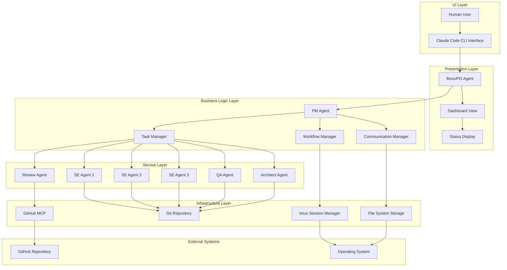

### 2.2 コンポーネント間依存関係図

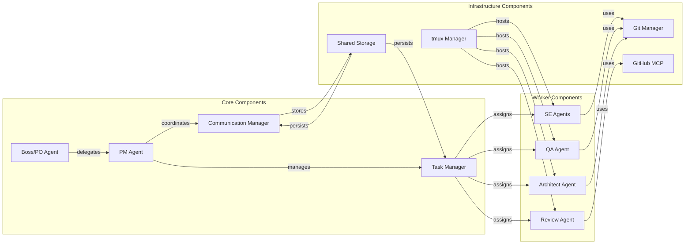

## 3. データフロー図

### 3.1 主要ワークフロー・データフロー

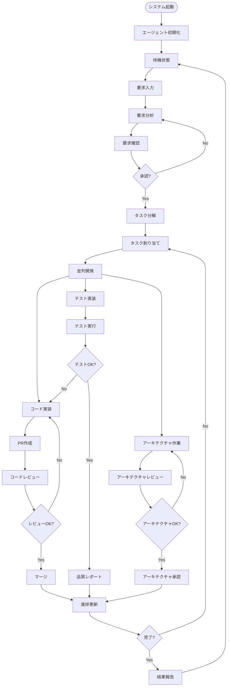

### 3.2 タスク管理データフロー

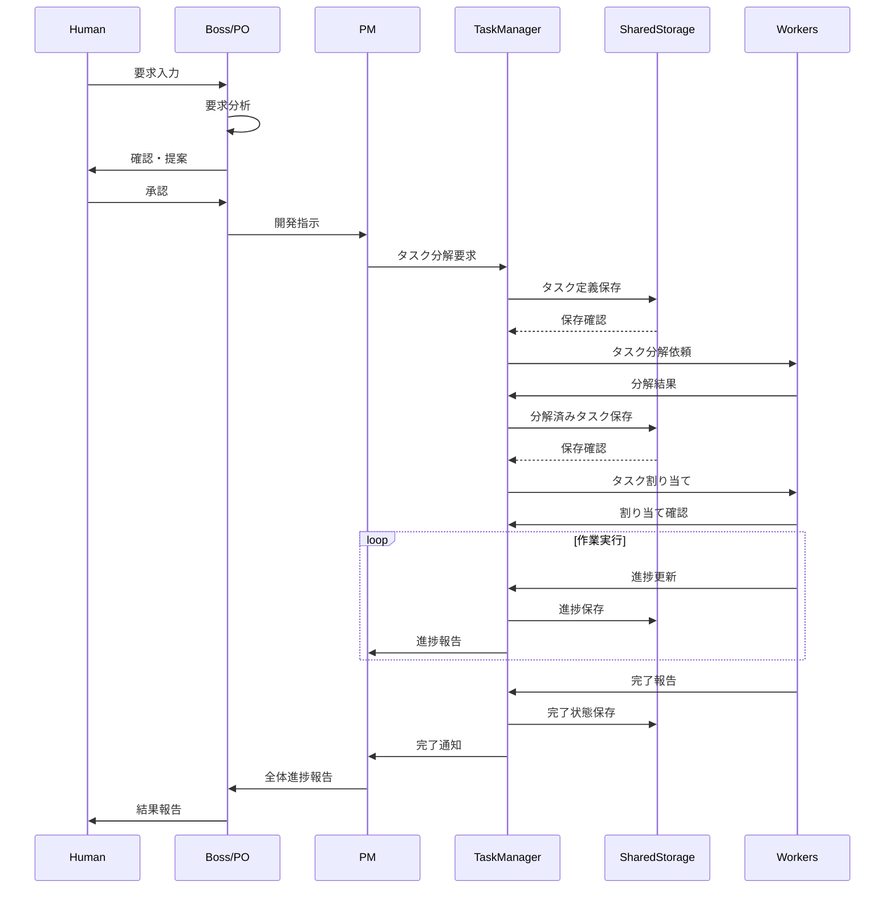

### 3.3 エージェント間通信フロー

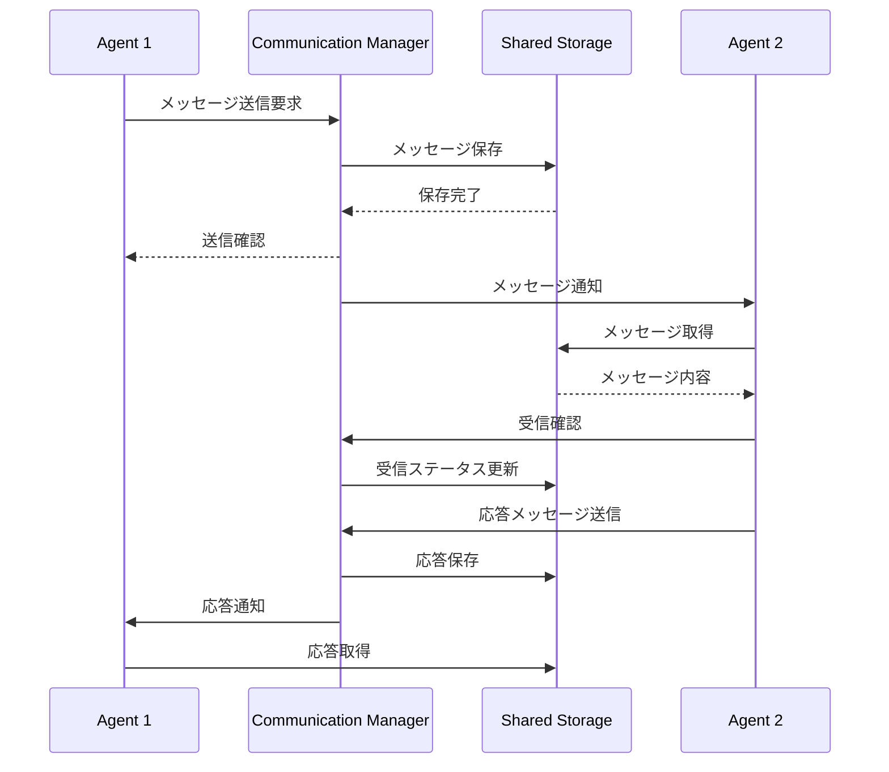

## 4. Git Worktree データフロー

### 4.1 並列開発環境構築フロー

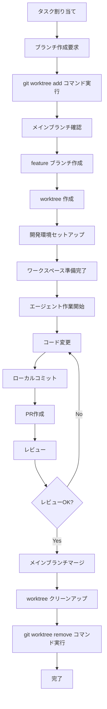

### 4.2 Git Worktree 管理構造

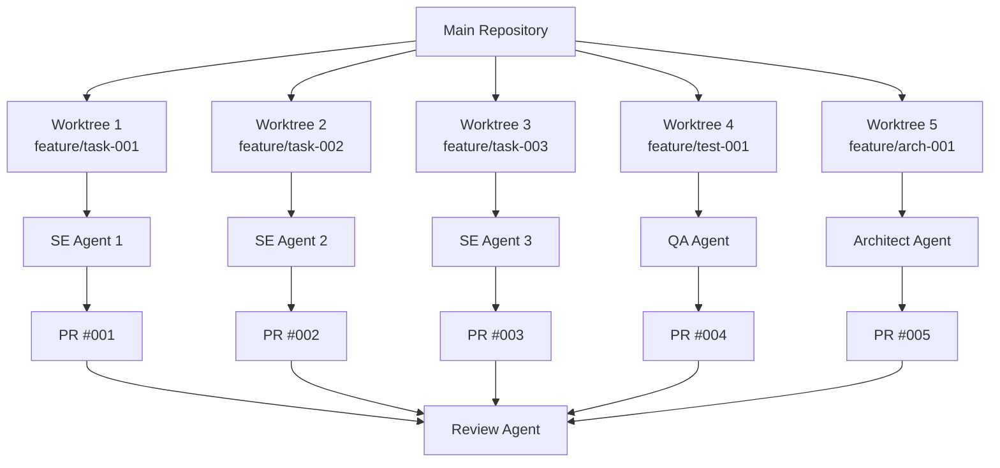

## 5. システム状態遷移図

### 5.1 エージェント状態遷移

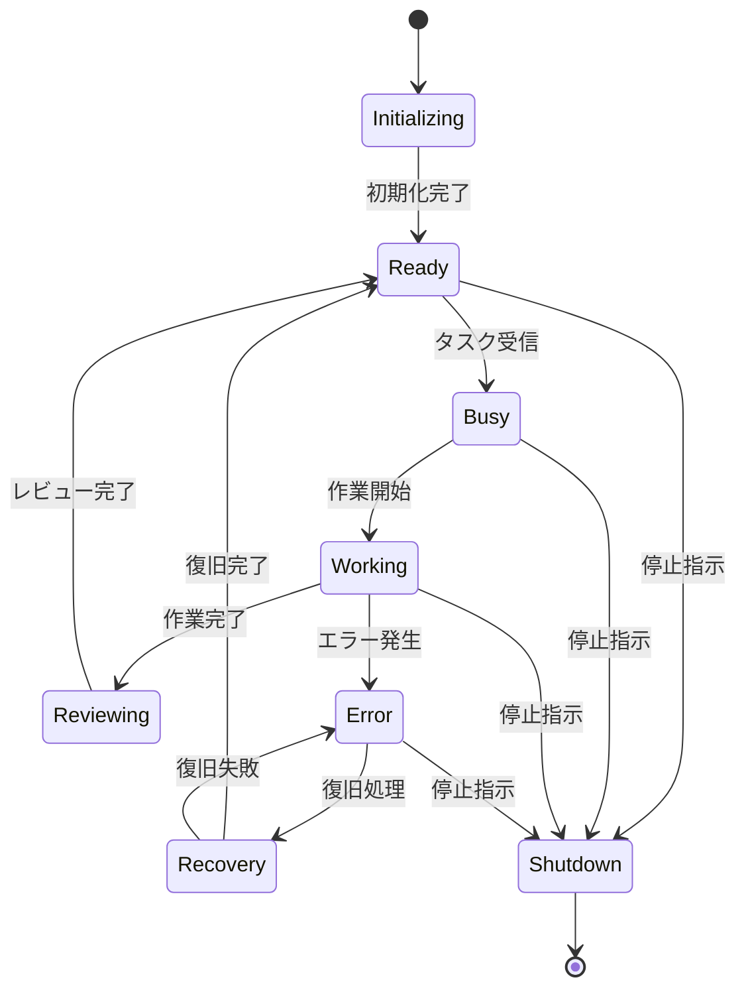

### 5.2 タスク状態遷移

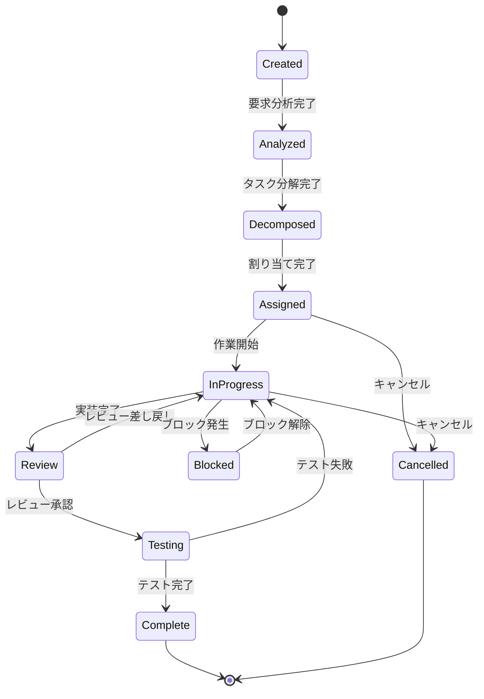

## 6. 通信アーキテクチャ図

### 6.1 tmux ベース通信構造

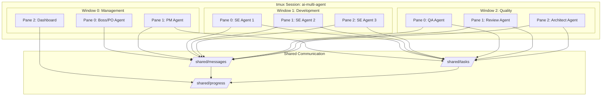

### 6.2 ファイルベース通信プロトコル

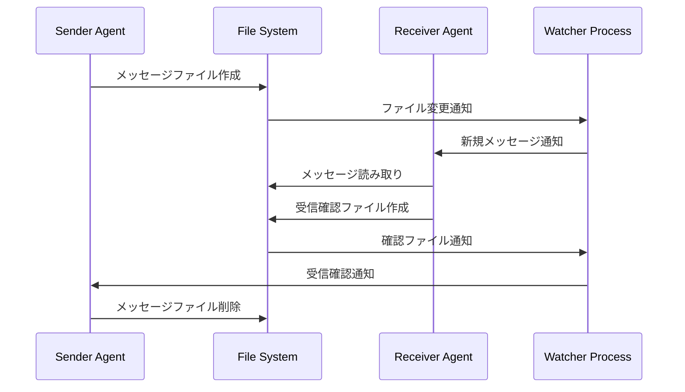

## 7. セキュリティアーキテクチャ図

### 7.1 権限管理構造

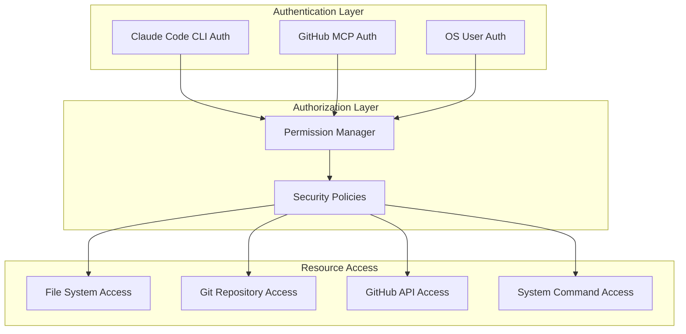

## 8. 監視・ログアーキテクチャ

### 8.1 ログ集約構造

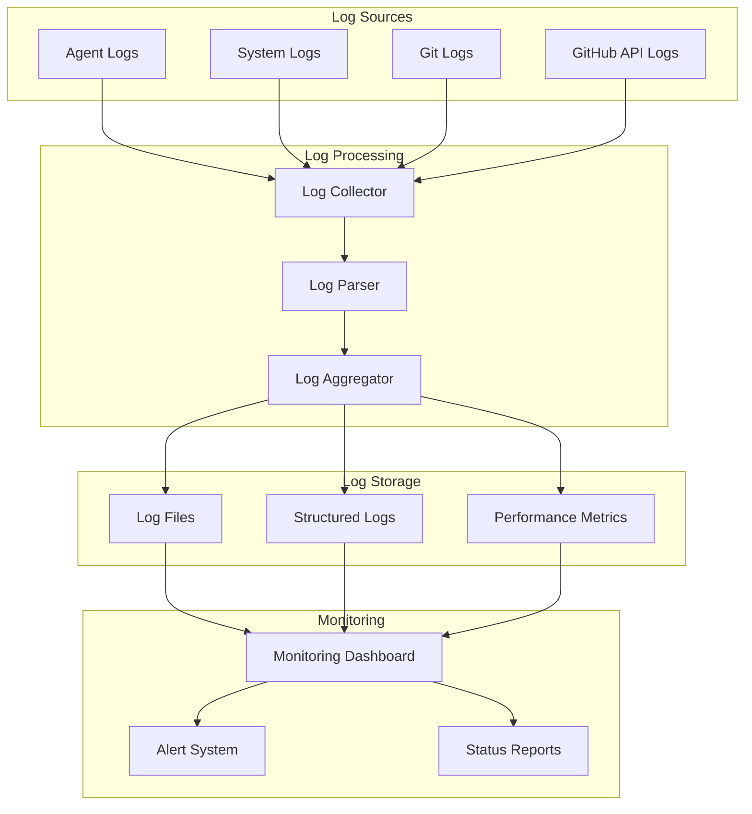

## 9. 配置図詳細

### 9.1 開発マシン内部構造

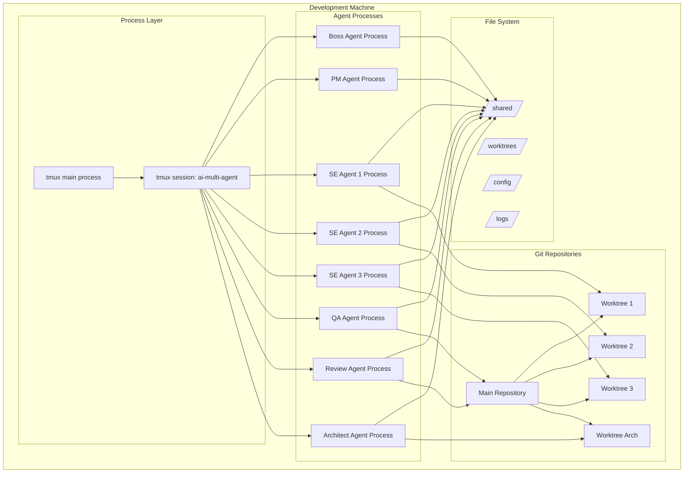

---

**承認**  
本アーキテクチャ・データフロー図は、MACCDSの構造理解と実装ガイドとして使用される。

作成日: 2025-01-07  
バージョン: 1.0.0