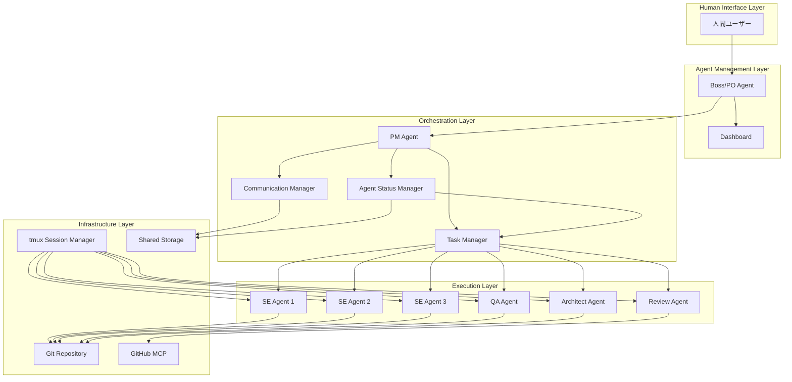
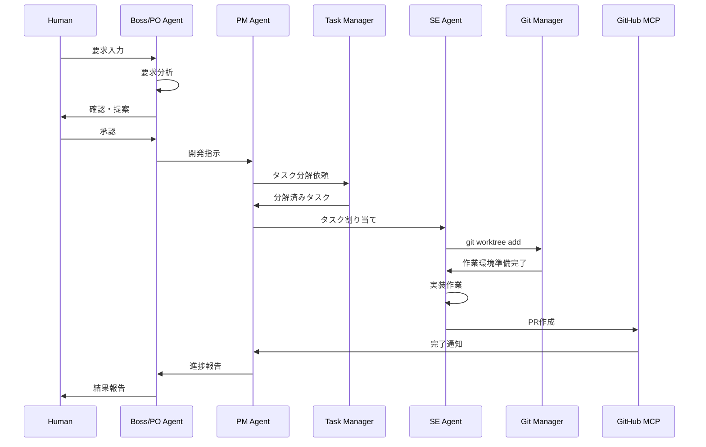

# Software Design Document (SDD)
## Multi-Agent Claude Code Development System (MACCDS)
### Version 1.0.0

## 1. 概要

### 1.1 目的
本文書は、AI Multi-Agent Claude Code Development System（MACCDS）の高レベル設計を定義する。システムアーキテクチャ、モジュール構成、技術選定などを記述し、詳細設計および実装の基盤を提供する。

### 1.2 適用範囲
- 対象システム：MACCDS全体
- 設計レベル：概要設計（アーキテクチャレベル）
- 対象読者：アーキテクト、エンジニア、プロジェクトマネージャー

### 1.3 参照文書
- [SRS (ソフトウェア要件仕様書)](../requirements/SRS_multi_claude_code_system.md)
- [ユースケース・ユーザーストーリー](../requirements/use_cases_user_stories.md)
- [受入条件](../requirements/acceptance_criteria.md)

## 2. システムアーキテクチャ

### 2.1 全体アーキテクチャ



### 2.2 レイヤー構成

#### 2.2.1 Human Interface Layer
- **責務**: 人間とシステム間の対話インターフェース
- **コンポーネント**: 
  - 人間ユーザー（開発者、PM、PO）

#### 2.2.2 Agent Management Layer
- **責務**: エージェント管理と人間との対話窓口
- **コンポーネント**:
  - Boss/PO Agent: 人間との対話、要求分析
  - Dashboard: 進捗可視化、システム状態監視

#### 2.2.3 Orchestration Layer
- **責務**: タスク管理とエージェント間協調
- **コンポーネント**:
  - PM Agent: プロジェクト管理、タスク分解・割り当て
  - Task Manager: タスク状態管理、進捗追跡
  - Communication Manager: エージェント間通信
  - Agent Status Manager: エージェント状態監視・管理

#### 2.2.4 Execution Layer
- **責務**: 実際の開発作業実行
- **コンポーネント**:
  - SE Agents: 実装作業
  - QA Agent: テスト・品質保証
  - Review Agent: コードレビュー
  - Architect Agent: アーキテクチャ設計

#### 2.2.5 Infrastructure Layer
- **責務**: システム基盤とツール連携
- **コンポーネント**:
  - tmux Session Manager: エージェント実行環境
  - Git Repository: バージョン管理・並列開発環境
  - GitHub MCP: GitHub連携
  - Shared Storage: エージェント間データ共有

## 3. 技術選定

### 3.1 アーキテクチャパターン
- **レイヤードアーキテクチャ**: 責務分離と保守性確保
- **マイクロサービス風**: 各エージェントが独立したサービス
- **Event-Driven**: 非同期メッセージングによる協調

### 3.2 技術スタック

#### 3.2.1 エージェント実行環境
- **Claude Code CLI**: 各エージェントの実行基盤
- **tmux**: マルチペイン管理とセッション制御
- **Bash Scripts**: システム制御とオーケストレーション

#### 3.2.2 開発ツール連携
- **Git + Worktree**: 並列開発環境
- **GitHub MCP**: GitHub API連携
- **各種MCP Servers**: 外部ツール連携

#### 3.2.3 データ管理
- **ファイルシステムベース**: 共有ディレクトリによるメッセージング
- **JSON**: 構造化データ交換フォーマット
- **Markdown**: ドキュメント管理

## 4. モジュール設計

### 4.1 Agent Management Module

#### 4.1.1 Boss/PO Agent
- **入力**: 人間からの要求・指示
- **処理**: 要求分析、合意形成、チーム指示
- **出力**: 分析結果、開発指示、進捗報告
- **依存関係**: PM Agent, Dashboard

#### 4.1.2 Dashboard Module
- **入力**: 各エージェントの状態情報
- **処理**: 情報集約、可視化
- **出力**: tmux画面表示、進捗レポート
- **依存関係**: tmux, 全エージェント

### 4.2 Orchestration Module

#### 4.2.1 PM Agent
- **入力**: Boss/POからの開発指示
- **処理**: タスク分解、割り当て、進捗管理
- **出力**: タスク仕様、進捗レポート
- **依存関係**: Task Manager, Communication Manager

#### 4.2.2 Task Manager
- **入力**: タスク定義、進捗更新
- **処理**: タスク状態管理、依存関係解決
- **出力**: タスクリスト、実行指示
- **依存関係**: Shared Storage

#### 4.2.3 Communication Manager
- **入力**: エージェント間メッセージ
- **処理**: メッセージルーティング、配信確認
- **出力**: メッセージ配信、ログ
- **依存関係**: Shared Storage, tmux

#### 4.2.4 Agent Status Manager
- **入力**: エージェント状態変更通知
- **処理**: エージェント状態監視、空きエージェント検出
- **出力**: 利用可能エージェント一覧、状態レポート
- **依存関係**: Shared Storage

### 4.3 Execution Module

#### 4.3.1 SE Agents
- **入力**: 実装タスク、技術仕様
- **処理**: コード実装、単体テスト
- **出力**: 実装コード、PR作成
- **依存関係**: Git Repository, GitHub MCP

#### 4.3.2 QA Agent
- **入力**: テストタスク、実装コード
- **処理**: テスト実行、品質検証
- **出力**: テスト結果、品質レポート
- **依存関係**: Git, テスト実行環境

#### 4.3.3 Review Agent
- **入力**: Pull Request、コード変更
- **処理**: 内部コードレビュー、品質チェック、外部レビュー結果収集
- **出力**: レビューコメント、承認/却下、統合レビュー結果
- **依存関係**: GitHub MCP

#### 4.3.4 External Review Monitor
- **入力**: GitHub PR情報、外部レビューツール状態
- **処理**: CodeRabbitレビュー状態監視、完了検出（ポーリング）
- **出力**: 外部レビュー結果、完了通知
- **依存関係**: GitHub API

#### 4.3.5 Architect Agent
- **入力**: アーキテクチャ設計タスク、技術要件
- **処理**: システム設計、インフラ構築、技術ドキュメント作成
- **出力**: 設計書、インフラスクリプト、MCPサーバー設定
- **依存関係**: Git Repository, 各種MCPサーバー

### 4.4 Infrastructure Module

#### 4.4.1 tmux Session Manager
- **入力**: エージェント起動/停止指示
- **処理**: セッション管理、ペイン制御
- **出力**: エージェント実行環境
- **依存関係**: OS (macOS/Linux)

#### 4.4.2 Git Repository
- **入力**: エージェントからのgitコマンド実行
- **処理**: worktree作成・削除、ブランチ管理、コミット・プッシュ
- **出力**: 独立開発環境、バージョン履歴
- **依存関係**: ファイルシステム

#### 4.4.3 GitHub MCP
- **入力**: PR作成/更新要求
- **処理**: GitHub API呼び出し
- **出力**: PR、レビュー、マージ
- **依存関係**: GitHub API

## 5. データフロー設計

### 5.1 主要データフロー



### 5.2 データ構造設計

#### 5.2.1 Task Definition
```json
{
  "taskId": "string",
  "title": "string",
  "description": "string",
  "assignee": "string",
  "priority": "high|medium|low",
  "status": "pending|in_progress|review|completed",
  "storyPoints": "number",
  "dependencies": ["taskId"],
  "branch": "string",
  "created": "ISO8601",
  "updated": "ISO8601"
}
```

#### 5.2.2 Agent Message
```json
{
  "messageId": "string",
  "from": "string",
  "to": "string",
  "type": "request|response|notification",
  "content": "object",
  "timestamp": "ISO8601",
  "status": "sent|delivered|acknowledged"
}
```

#### 5.2.3 Progress Report
```json
{
  "reportId": "string",
  "timestamp": "ISO8601",
  "overallProgress": "number",
  "tasks": [
    {
      "taskId": "string",
      "progress": "number",
      "blockers": ["string"]
    }
  ],
  "agentStatus": {
    "agentId": "online|busy|error"
  }
}
```

## 6. 非機能設計

### 6.1 性能設計
- **並列処理**: 最大10エージェント同時実行
- **応答時間**: タスク割り当て5秒以内、通信1秒以内
- **スループット**: 1日100タスク処理能力

### 6.2 信頼性設計
- **エラー検出**: ヘルスチェック機能
- **自動復旧**: エージェント再起動機能
- **データ永続化**: タスク状態の定期保存

### 6.3 セキュリティ設計
- **認証**: Claude Code CLI認証利用
- **認可**: GitHub MCP権限管理
- **データ保護**: ローカルファイルシステム利用

### 6.4 保守性設計
- **モジュール化**: 独立したエージェント構成
- **設定管理**: YAML設定ファイル
- **ログ管理**: 構造化ログ出力

## 7. 配置設計

### 7.1 システム配置図

```mermaid
deployment
    node "Development Machine" {
        node "tmux Session" {
            component "Boss/PO Agent"
            component "PM Agent"
            component "SE Agent 1"
            component "SE Agent 2"
            component "SE Agent 3"
            component "QA Agent"
            component "Review Agent"
        }
        
        node "File System" {
            component "Shared Storage"
            component "Git Worktrees"
            component "Config Files"
        }
    }
    
    node "GitHub" {
        component "Repository"
        component "Pull Requests"
        component "Issues"
    }
    
    "tmux Session" --> "File System"
    "SE Agent 1" --> "GitHub"
    "SE Agent 2" --> "GitHub"
    "SE Agent 3" --> "GitHub"
    "Review Agent" --> "GitHub"
```

### 7.2 ディレクトリ構成
```
project-root/
├── ai-multi-agent/           # MACCDSフレームワーク
│   ├── agents/              # エージェント定義
│   │   ├── boss/
│   │   ├── pm/
│   │   ├── engineer/
│   │   ├── qa/
│   │   └── review/
│   ├── shared/              # 共有データ
│   │   ├── tasks/
│   │   ├── messages/
│   │   └── progress/
│   ├── scripts/             # 制御スクリプト
│   │   ├── start-agents.sh
│   │   ├── stop-agents.sh
│   │   └── utils/
│   └── config/              # 設定ファイル
│       ├── agents.yaml
│       └── system.yaml
├── worktrees/               # Git worktree
│   ├── feature-1/
│   ├── feature-2/
│   └── ...
└── src/                     # プロジェクトソース
```

## 8. インターフェース設計

### 8.1 外部インターフェース
- **Claude Code CLI**: エージェント実行
- **GitHub API**: PR/Issue管理
- **Git**: バージョン管理
- **tmux**: セッション管理

### 8.2 内部インターフェース
- **Agent Communication**: JSON メッセージング
- **Task Management**: RESTful風インターフェース
- **Status Monitoring**: Push/Pull型データ更新

## 9. 設計制約

### 9.1 技術制約
- Claude Code CLIの機能制限
- tmuxベースの実装制約
- ローカル実行環境限定

### 9.2 性能制約
- CPU/メモリリソース
- GitHub API制限
- ファイルシステムI/O

### 9.3 運用制約
- 人間による最終承認必須
- セキュリティポリシー準拠
- バックアップ・復旧手順

## 10. 設計検証

### 10.1 アーキテクチャ評価
- レイヤー間の責務分離
- モジュール結合度
- 拡張性・保守性

### 10.2 性能評価
- 並列処理効率
- リソース使用量
- 応答時間特性

### 10.3 信頼性評価
- 障害点分析
- 復旧手順検証
- データ整合性確認

---

**承認**  
本設計書は、MACCDSの概要設計を定義し、詳細設計フェーズの基盤として使用される。

作成日: 2025-01-07  
バージョン: 1.0.0