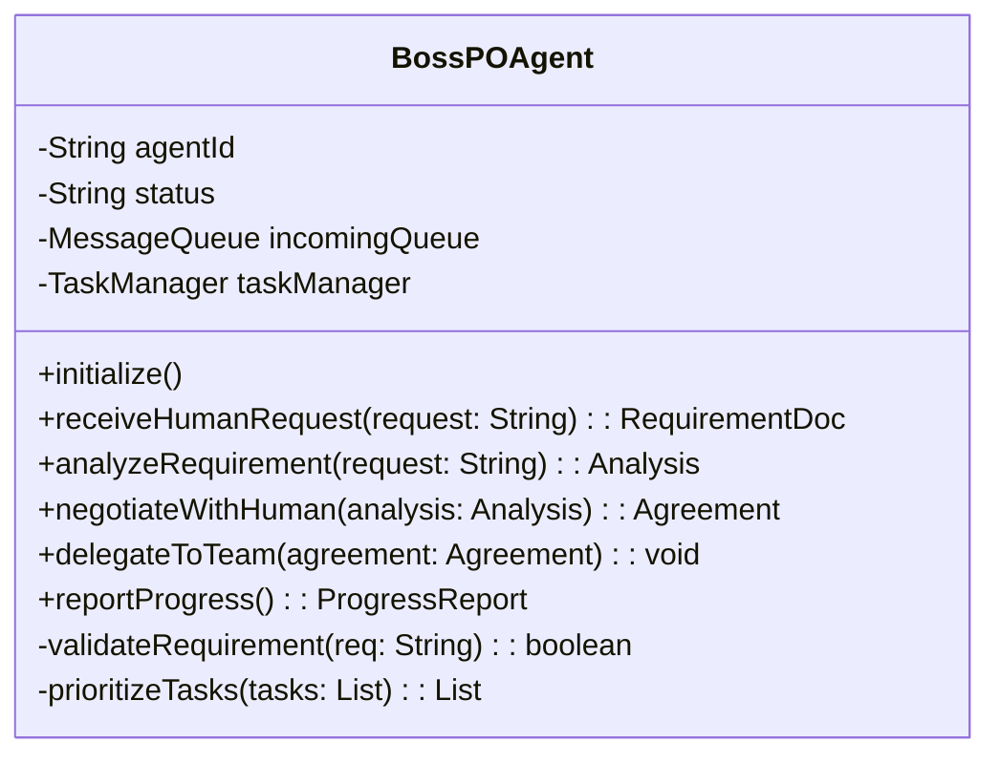
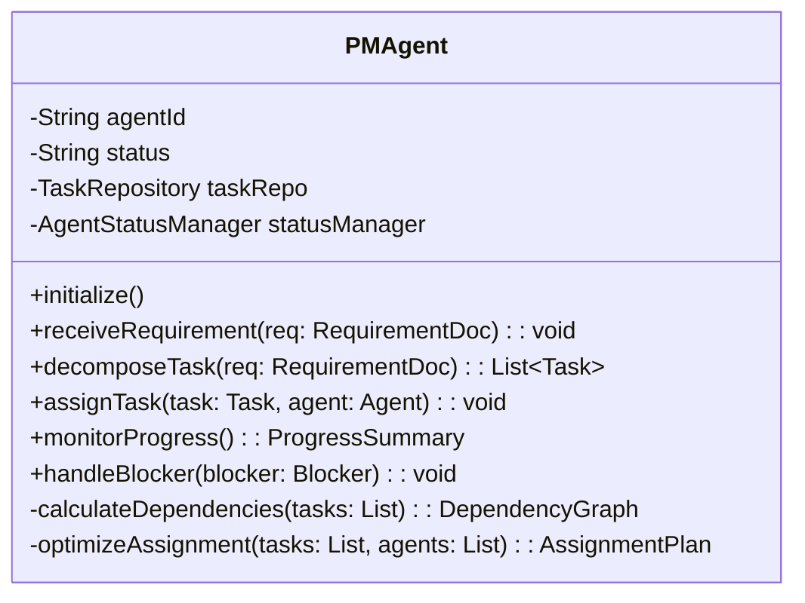
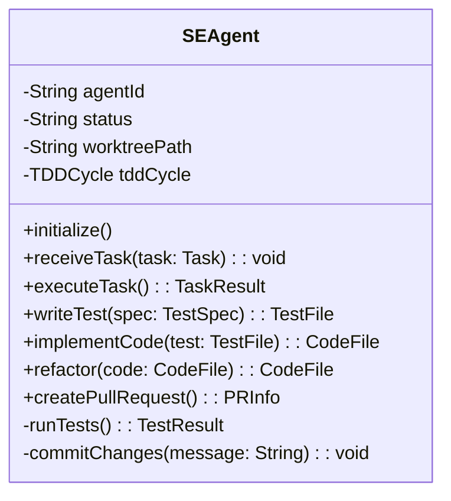

# Software Design Description (SDD)
## Multi-Agent Claude Code Development System (MACCDS)
### Version 1.0.0

## 1. 概要

### 1.1 目的
本文書は、MACCDSの詳細設計を記述し、各コンポーネントの内部構造、インターフェース、および実装方法を定義する。

### 1.2 適用範囲
- クラス設計とメソッド仕様
- シーケンス図による詳細な処理フロー
- データ構造とアルゴリズム
- エラーハンドリング詳細

### 1.3 参照文書
- [Software Design Document](../design/software_design_document.md)
- [Interface Specification](../design/interface_specification.md)

## 2. クラス設計

### 2.1 Boss/PO Agent クラス



#### 2.1.1 メソッド仕様

**initialize()**
- 説明: エージェントの初期化
- 引数: なし
- 戻り値: void
- 例外: InitializationException

**receiveHumanRequest(request: String)**
- 説明: 人間からの要求を受信し、要求文書を生成
- 引数: request - 人間からの要求文字列
- 戻り値: RequirementDoc - 構造化された要求文書
- 例外: InvalidRequestException

### 2.2 PM Agent クラス



### 2.3 SE Agent クラス



### 2.4 Review Agent クラス


## 3. シーケンス図

### 3.1 タスク割り当てシーケンス


### 3.2 TDDサイクル詳細シーケンス


### 3.3 レビュー処理詳細シーケンス


## 4. データ構造詳細

### 4.1 Task データ構造

```typescript
interface Task {
    taskId: string;           // UUID v4
    title: string;            // 最大200文字
    description: string;      // Markdown形式
    type: TaskType;          // enum
    assignee?: string;       // agent_id
    status: TaskStatus;      // enum
    priority: Priority;      // high|medium|low
    storyPoints: number;     // 1-13
    dependencies: string[];  // taskId配列
    metadata: {
        createdAt: Date;
        updatedAt: Date;
        createdBy: string;
        tags: string[];
        branch?: string;     // feature/task-xxx
        pullRequestId?: number;
    };
    acceptanceCriteria: AcceptanceCriterion[];
}

interface AcceptanceCriterion {
    id: string;
    description: string;
    testable: boolean;
    completed: boolean;
}

enum TaskType {
    IMPLEMENTATION = "implementation",
    TESTING = "testing",
    REVIEW = "review",
    ARCHITECTURE = "architecture",
    INFRASTRUCTURE = "infrastructure",
    DOCUMENTATION = "documentation"
}

enum TaskStatus {
    CREATED = "created",
    ASSIGNED = "assigned",
    IN_PROGRESS = "in_progress",
    REVIEW = "review",
    TESTING = "testing",
    COMPLETED = "completed",
    BLOCKED = "blocked",
    CANCELLED = "cancelled"
}
```

### 4.2 Agent Message データ構造

```typescript
interface AgentMessage {
    messageId: string;        // UUID v4
    timestamp: Date;         // ISO 8601
    from: string;           // agent_id
    to: string | "broadcast"; // agent_id or broadcast
    type: MessageType;
    priority: Priority;
    content: MessageContent;
    metadata: {
        correlationId?: string;  // 関連メッセージID
        replyTo?: string;       // 返信先メッセージID
        ttl?: number;          // Time to Live (秒)
        retryCount?: number;   // 再送回数
    };
}

type MessageContent = 
    | TaskAssignmentMessage
    | ProgressUpdateMessage
    | BlockerNotificationMessage
    | ReviewRequestMessage
    | CommandMessage;

interface TaskAssignmentMessage {
    action: "ASSIGN_TASK";
    taskId: string;
    deadline?: Date;
    notes?: string;
}

interface ProgressUpdateMessage {
    action: "UPDATE_PROGRESS";
    taskId: string;
    progress: number;      // 0-100
    message: string;
    blockers?: string[];
}
```

### 4.3 Agent Status データ構造

```typescript
interface AgentStatus {
    agentId: string;
    type: AgentType;
    status: AgentState;
    currentTask?: string;
    workload: number;       // 0-10
    lastHeartbeat: Date;
    capabilities: string[];
    metadata: {
        worktreePath?: string;
        sessionInfo?: {
            tmuxSession: string;
            tmuxWindow: number;
            tmuxPane: number;
        };
        performance?: {
            tasksCompleted: number;
            averageTime: number;
            successRate: number;
        };
    };
}

enum AgentState {
    INITIALIZING = "initializing",
    FREE = "free",
    BUSY = "busy",
    WORKING = "working",
    ERROR = "error",
    OFFLINE = "offline"
}
```

## 5. アルゴリズム詳細

### 5.1 タスク割り当てアルゴリズム

```typescript
class TaskAssignmentOptimizer {
    /**
     * タスクを最適なエージェントに割り当て
     */
    optimizeAssignment(
        tasks: Task[], 
        agents: AgentStatus[]
    ): Map<string, string> {
        const assignments = new Map<string, string>();
        
        // 1. タスクを優先度とストーリーポイントでソート
        const sortedTasks = tasks.sort((a, b) => {
            if (a.priority !== b.priority) {
                return this.priorityValue(a.priority) - 
                       this.priorityValue(b.priority);
            }
            return b.storyPoints - a.storyPoints;
        });
        
        // 2. 各タスクに対して最適なエージェントを選択
        for (const task of sortedTasks) {
            const availableAgents = agents.filter(agent => 
                agent.status === AgentState.FREE &&
                this.hasCapability(agent, task.type) &&
                agent.workload + task.storyPoints <= 10
            );
            
            if (availableAgents.length === 0) {
                continue; // 後で再割り当て
            }
            
            // 3. 負荷分散を考慮して選択
            const selectedAgent = availableAgents.reduce((best, current) => 
                current.workload < best.workload ? current : best
            );
            
            assignments.set(task.taskId, selectedAgent.agentId);
            selectedAgent.workload += task.storyPoints;
        }
        
        return assignments;
    }
    
    private priorityValue(priority: Priority): number {
        switch (priority) {
            case Priority.HIGH: return 1;
            case Priority.MEDIUM: return 2;
            case Priority.LOW: return 3;
        }
    }
}
```

### 5.2 非ブロックファイル書き込みアルゴリズム

```typescript
class NonBlockingFileWriter {
    /**
     * 非ブロックでファイルに書き込み
     */
    async writeFile(
        filePath: string, 
        content: string,
        agentId: string
    ): Promise<void> {
        // 1. 一時ファイル名生成
        const timestamp = new Date().toISOString().replace(/[:.]/g, '-');
        const uuid = crypto.randomUUID();
        const tempFile = `${agentId}_${timestamp}_${uuid}.tmp`;
        const tempPath = path.join(path.dirname(filePath), 'temp', tempFile);
        
        try {
            // 2. 一時ファイルに書き込み
            await fs.writeFile(tempPath, content, 'utf8');
            
            // 3. アトミックに移動
            await fs.rename(tempPath, filePath);
            
        } catch (error) {
            // 4. エラー時は一時ファイルを削除
            await fs.unlink(tempPath).catch(() => {});
            throw error;
        }
    }
    
    /**
     * 複数の一時ファイルを結合
     */
    async consolidateFiles(
        pattern: string,
        outputPath: string
    ): Promise<void> {
        const files = await glob(pattern);
        const sortedFiles = files.sort(); // タイムスタンプ順
        
        const writeStream = createWriteStream(outputPath);
        
        for (const file of sortedFiles) {
            const content = await fs.readFile(file, 'utf8');
            writeStream.write(content);
            writeStream.write('\n');
            
            // 処理済みファイルを削除
            await fs.unlink(file);
        }
        
        writeStream.end();
    }
}
```

## 6. エラーハンドリング

### 6.1 エラー階層

```typescript
class MACCDSError extends Error {
    constructor(
        message: string,
        public code: string,
        public severity: 'low' | 'medium' | 'high' | 'critical',
        public recoverable: boolean
    ) {
        super(message);
        this.name = 'MACCDSError';
    }
}

class AgentError extends MACCDSError {
    constructor(
        message: string,
        public agentId: string,
        code: string,
        severity: 'low' | 'medium' | 'high' | 'critical',
        recoverable: boolean
    ) {
        super(message, code, severity, recoverable);
        this.name = 'AgentError';
    }
}

class TaskError extends MACCDSError {
    constructor(
        message: string,
        public taskId: string,
        code: string
    ) {
        super(message, code, 'high', true);
        this.name = 'TaskError';
    }
}
```

### 6.2 エラーハンドリング戦略

```typescript
class ErrorHandler {
    async handle(error: Error, context: ExecutionContext): Promise<void> {
        if (error instanceof MACCDSError) {
            await this.logError(error, context);
            
            if (error.recoverable) {
                await this.attemptRecovery(error, context);
            } else {
                await this.escalate(error, context);
            }
            
            if (error.severity === 'critical') {
                await this.notifyHuman(error, context);
            }
        } else {
            // 予期しないエラー
            await this.handleUnexpectedError(error, context);
        }
    }
    
    private async attemptRecovery(
        error: MACCDSError, 
        context: ExecutionContext
    ): Promise<void> {
        const strategies = {
            'AGT_001': () => this.restartAgent(context.agentId),
            'TSK_001': () => this.retryTask(context.taskId),
            'GIT_001': () => this.resetGitState(context.worktreePath),
            // ... 他のリカバリー戦略
        };
        
        const strategy = strategies[error.code];
        if (strategy) {
            await strategy();
        }
    }
}
```

## 7. パフォーマンス考慮事項

### 7.1 並列処理最適化

```typescript
class ParallelExecutor {
    private readonly MAX_CONCURRENT = 10;
    private readonly BATCH_SIZE = 5;
    
    async executeParallel<T>(
        tasks: (() => Promise<T>)[]
    ): Promise<T[]> {
        const results: T[] = [];
        
        // バッチ処理で実行
        for (let i = 0; i < tasks.length; i += this.BATCH_SIZE) {
            const batch = tasks.slice(i, i + this.BATCH_SIZE);
            const batchResults = await Promise.all(
                batch.map(task => this.executeWithTimeout(task))
            );
            results.push(...batchResults);
        }
        
        return results;
    }
    
    private async executeWithTimeout<T>(
        task: () => Promise<T>,
        timeout: number = 30000
    ): Promise<T> {
        return Promise.race([
            task(),
            new Promise<T>((_, reject) => 
                setTimeout(() => reject(new Error('Timeout')), timeout)
            )
        ]);
    }
}
```

### 7.2 キャッシング戦略

```typescript
class CacheManager {
    private cache = new Map<string, CacheEntry>();
    private readonly TTL = 300000; // 5分
    
    async get<T>(
        key: string, 
        factory: () => Promise<T>
    ): Promise<T> {
        const cached = this.cache.get(key);
        
        if (cached && cached.expiry > Date.now()) {
            return cached.value as T;
        }
        
        const value = await factory();
        this.cache.set(key, {
            value,
            expiry: Date.now() + this.TTL
        });
        
        return value;
    }
    
    invalidate(pattern: string): void {
        const regex = new RegExp(pattern);
        for (const key of this.cache.keys()) {
            if (regex.test(key)) {
                this.cache.delete(key);
            }
        }
    }
}
```

---

**承認**  
本詳細設計書は、MACCDSの実装ガイドラインとして使用される。

作成日: 2025-01-07  
バージョン: 1.0.0