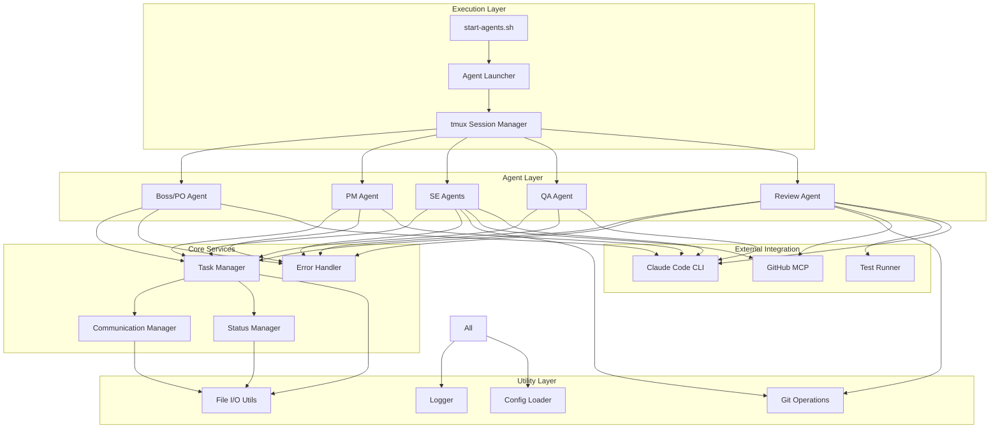
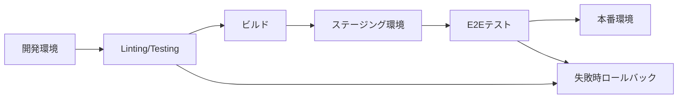

# Technical Design Document (TDD)
## Multi-Agent Claude Code Development System (MACCDS)
### Version 1.0.0

## 1. 概要

### 1.1 目的
本文書は、MACCDSの技術的な詳細設計を定義し、プログラム構成、外部ライブラリ、UML図、パフォーマンス目標などを記述する。

### 1.2 適用範囲
- システムアーキテクチャの技術詳細
- 使用技術とライブラリの選定理由
- パフォーマンス要件と最適化戦略
- セキュリティ設計

## 2. システム構成

### 2.1 ディレクトリ構造

```
ai-multi-agent/
├── src/                          # ソースコード
│   ├── agents/                   # エージェント実装
│   │   ├── base/                # 基底クラス
│   │   │   └── agent.sh
│   │   ├── boss/                # Boss/POエージェント
│   │   │   ├── boss_agent.sh
│   │   │   └── CLAUDE.md
│   │   ├── pm/                  # PMエージェント
│   │   │   ├── pm_agent.sh
│   │   │   └── CLAUDE.md
│   │   ├── engineer/            # SEエージェント
│   │   │   ├── se_agent.sh
│   │   │   └── CLAUDE.md
│   │   ├── qa/                  # QAエージェント
│   │   │   ├── qa_agent.sh
│   │   │   └── CLAUDE.md
│   │   └── review/              # Reviewエージェント
│   │       ├── review_agent.sh
│   │       └── CLAUDE.md
│   ├── core/                    # コアモジュール
│   │   ├── task_manager.sh
│   │   ├── communication.sh
│   │   ├── status_manager.sh
│   │   └── error_handler.sh
│   ├── utils/                   # ユーティリティ
│   │   ├── file_io.sh
│   │   ├── git_operations.sh
│   │   ├── tmux_manager.sh
│   │   └── logger.sh
│   └── integrations/            # 外部連携
│       ├── github_mcp.sh
│       └── test_runner.sh
├── config/                      # 設定ファイル
│   ├── agents.yaml
│   ├── system.yaml
│   └── environments/
│       ├── development.yaml
│       ├── testing.yaml
│       └── production.yaml
├── scripts/                     # 実行スクリプト
│   ├── start-agents.sh
│   ├── stop-agents.sh
│   ├── setup.sh
│   └── cleanup.sh
├── shared/                      # 共有データディレクトリ
│   ├── messages/
│   ├── tasks/
│   ├── status/
│   └── logs/
├── worktrees/                   # Git worktree用
├── tests/                       # テストコード
│   ├── unit/
│   ├── integration/
│   └── e2e/
└── docs/                        # ドキュメント
```

### 2.2 モジュール構成図



## 3. 技術スタック

### 3.1 コア技術

| カテゴリ | 技術 | バージョン | 用途 |
|---------|------|-----------|------|
| ランタイム | Bash | 5.0+ | スクリプト実行環境 |
| エージェント実行 | Claude Code CLI | 最新 | AIエージェント基盤 |
| セッション管理 | tmux | 3.0+ | マルチペイン管理 |
| バージョン管理 | Git | 2.30+ | ソースコード管理 |
| | Git Worktree | - | 並列開発環境 |

### 3.2 外部ライブラリ/ツール

| ライブラリ | 用途 | 選定理由 |
|-----------|------|----------|
| GitHub MCP | GitHub連携 | PR作成・レビュー自動化 |
| jq | JSON処理 | 軽量で高速なJSON操作 |
| yq | YAML処理 | 設定ファイル読み込み |
| ripgrep (rg) | 高速検索 | 大規模コードベース対応 |
| fzf | インタラクティブ選択 | ユーザビリティ向上 |
| shellcheck | シェルスクリプト検証 | 品質保証 |

### 3.3 依存関係管理

```bash
# scripts/setup.sh
#!/bin/bash

# 必須コマンドのチェック
check_dependencies() {
    local deps=(
        "bash:5.0"
        "tmux:3.0"
        "git:2.30"
        "jq:1.6"
        "yq:4.0"
        "rg:13.0"
        "claude"
    )
    
    for dep in "${deps[@]}"; do
        IFS=':' read -r cmd version <<< "$dep"
        if ! command -v "$cmd" &> /dev/null; then
            echo "Error: $cmd is not installed"
            exit 1
        fi
    done
}
```

## 4. パフォーマンス設計

### 4.1 パフォーマンス目標

| メトリクス | 目標値 | 測定方法 |
|-----------|--------|----------|
| エージェント起動時間 | < 5秒 | 初期化完了まで |
| タスク割り当て時間 | < 3秒 | 要求から割り当てまで |
| メッセージ配信遅延 | < 1秒 | 送信から受信まで |
| ファイルI/O遅延 | < 100ms | 書き込み完了まで |
| 並列実行エージェント数 | 10+ | 同時実行可能数 |
| メモリ使用量（per agent） | < 500MB | 常駐メモリ |
| CPU使用率（idle時） | < 5% | アイドル時CPU |

### 4.2 最適化戦略

#### 4.2.1 非同期処理

```bash
# 非同期メッセージ送信
send_message_async() {
    local message=$1
    local target=$2
    
    # バックグラウンドで送信
    {
        echo "$message" > "shared/messages/temp/${AGENT_ID}_$(date +%s%N).tmp"
        mv "shared/messages/temp/${AGENT_ID}_$(date +%s%N).tmp" \
           "shared/messages/inbox/${target}.json"
    } &
}
```

#### 4.2.2 バッチ処理

```bash
# タスク一括処理
process_tasks_batch() {
    local batch_size=5
    local tasks=()
    
    # タスクをバッチで収集
    while IFS= read -r task; do
        tasks+=("$task")
        
        if [[ ${#tasks[@]} -ge $batch_size ]]; then
            process_batch "${tasks[@]}"
            tasks=()
        fi
    done < <(find shared/tasks/pending -name "*.json")
    
    # 残りのタスクを処理
    if [[ ${#tasks[@]} -gt 0 ]]; then
        process_batch "${tasks[@]}"
    fi
}
```

#### 4.2.3 キャッシング

```bash
# 設定キャッシュ
declare -A CONFIG_CACHE

load_config_cached() {
    local config_file=$1
    local cache_key="config_${config_file}"
    
    # キャッシュチェック
    if [[ -n "${CONFIG_CACHE[$cache_key]}" ]]; then
        echo "${CONFIG_CACHE[$cache_key]}"
        return
    fi
    
    # ファイルから読み込み
    local content=$(yq eval '.' "$config_file" -o json)
    CONFIG_CACHE[$cache_key]=$content
    
    echo "$content"
}
```

## 5. セキュリティ設計

### 5.1 セキュリティ原則

1. **最小権限の原則**: 各エージェントは必要最小限の権限で動作
2. **入力検証**: すべての外部入力を検証
3. **機密情報保護**: 認証情報は環境変数で管理
4. **監査ログ**: すべての重要操作をログ記録

### 5.2 セキュリティ実装

#### 5.2.1 入力サニタイゼーション

```bash
# 入力検証とサニタイゼーション
sanitize_input() {
    local input=$1
    local type=$2
    
    case $type in
        "filename")
            # ファイル名として安全な文字のみ許可
            echo "$input" | sed 's/[^a-zA-Z0-9._-]//g'
            ;;
        "json")
            # JSONとして検証
            if jq -e . >/dev/null 2>&1 <<< "$input"; then
                echo "$input"
            else
                echo "{}"
            fi
            ;;
        "command")
            # コマンドインジェクション対策
            printf '%q' "$input"
            ;;
    esac
}
```

#### 5.2.2 認証情報管理

```bash
# .env.example
GITHUB_TOKEN=
CLAUDE_API_KEY=
SLACK_WEBHOOK_URL=

# 環境変数の安全な読み込み
load_secrets() {
    if [[ -f .env ]]; then
        # .envファイルの権限チェック
        if [[ $(stat -c %a .env 2>/dev/null || stat -f %A .env) != "600" ]]; then
            echo "Error: .env file permissions must be 600"
            exit 1
        fi
        
        # 環境変数として読み込み
        set -a
        source .env
        set +a
    fi
}
```

## 6. ロギングとモニタリング

### 6.1 ログレベル

```bash
# ログレベル定義
declare -A LOG_LEVELS=(
    [DEBUG]=0
    [INFO]=1
    [WARN]=2
    [ERROR]=3
    [FATAL]=4
)

# 構造化ログ出力
log() {
    local level=$1
    local message=$2
    local context=${3:-"{}"}
    
    local timestamp=$(date -u +"%Y-%m-%dT%H:%M:%S.%3NZ")
    local log_entry=$(jq -n \
        --arg ts "$timestamp" \
        --arg lvl "$level" \
        --arg msg "$message" \
        --arg agent "$AGENT_ID" \
        --argjson ctx "$context" \
        '{timestamp: $ts, level: $lvl, message: $msg, agent: $agent, context: $ctx}'
    )
    
    echo "$log_entry" >> "shared/logs/${AGENT_ID}_$(date +%Y%m%d).json"
}
```

### 6.2 メトリクス収集

```bash
# パフォーマンスメトリクス記録
record_metric() {
    local metric_name=$1
    local value=$2
    local tags=$3
    
    local metric=$(jq -n \
        --arg name "$metric_name" \
        --arg val "$value" \
        --arg ts "$(date -u +%s)" \
        --argjson tags "$tags" \
        '{metric: $name, value: $val, timestamp: $ts, tags: $tags}'
    )
    
    echo "$metric" >> "shared/metrics/$(date +%Y%m%d).jsonl"
}

# 使用例
measure_execution_time() {
    local start=$(date +%s%N)
    "$@"  # コマンド実行
    local end=$(date +%s%N)
    local duration=$((($end - $start) / 1000000))  # ミリ秒
    
    record_metric "execution_time" "$duration" '{"command": "'$1'"}'
}
```

## 7. エラーハンドリングとリカバリー

### 7.1 エラーハンドリングパターン

```bash
# グローバルエラーハンドラー
set -eE
trap 'error_handler $? $LINENO' ERR

error_handler() {
    local exit_code=$1
    local line_number=$2
    
    log "ERROR" "Command failed with exit code $exit_code at line $line_number" \
        '{"exit_code": '$exit_code', "line": '$line_number'}'
    
    # リカバリー試行
    case $exit_code in
        1)  recovery_general_error ;;
        2)  recovery_file_error ;;
        126) recovery_permission_error ;;
        127) recovery_command_not_found ;;
        *)  recovery_unknown_error ;;
    esac
}

# リトライメカニズム
retry_with_backoff() {
    local max_attempts=3
    local timeout=1
    local attempt=0
    
    until "$@"; do
        attempt=$((attempt + 1))
        if [[ $attempt -ge $max_attempts ]]; then
            log "ERROR" "Command failed after $max_attempts attempts: $*"
            return 1
        fi
        
        log "WARN" "Command failed, retrying in ${timeout}s... (attempt $attempt/$max_attempts)"
        sleep $timeout
        timeout=$((timeout * 2))
    done
}
```

### 7.2 状態復旧

```bash
# エージェント状態復旧
recover_agent_state() {
    local agent_id=$1
    
    # 1. 現在の状態を保存
    save_crash_dump "$agent_id"
    
    # 2. プロセスクリーンアップ
    cleanup_agent_processes "$agent_id"
    
    # 3. 作業ディレクトリリセット
    reset_working_directory "$agent_id"
    
    # 4. タスク状態復元
    restore_task_state "$agent_id"
    
    # 5. エージェント再起動
    restart_agent "$agent_id"
}
```

## 8. テスト戦略

### 8.1 テストカバレッジ目標

| テスト種別 | カバレッジ目標 | 対象 |
|-----------|--------------|------|
| ユニットテスト | 80%以上 | 個別関数・モジュール |
| 統合テスト | 70%以上 | モジュール間連携 |
| E2Eテスト | 主要フロー100% | エンドツーエンドシナリオ |

### 8.2 テスト実装例

```bash
# tests/unit/test_task_manager.sh
#!/bin/bash

source "$(dirname "$0")/../../src/core/task_manager.sh"

test_task_creation() {
    local task_id=$(create_task "Test Task" "implementation" "high")
    
    assert_not_empty "$task_id" "Task ID should not be empty"
    assert_file_exists "shared/tasks/pending/task_${task_id}.json"
    
    local task_data=$(cat "shared/tasks/pending/task_${task_id}.json")
    assert_json_field "$task_data" ".title" "Test Task"
    assert_json_field "$task_data" ".type" "implementation"
    assert_json_field "$task_data" ".priority" "high"
}

test_task_assignment() {
    local task_id=$(create_task "Test Task" "implementation" "high")
    local result=$(assign_task "$task_id" "se_agent_1")
    
    assert_equals "$result" "success" "Task assignment should succeed"
    assert_file_exists "shared/tasks/assigned/task_${task_id}.json"
    
    local status=$(get_task_status "$task_id")
    assert_equals "$status" "assigned" "Task status should be 'assigned'"
}
```

## 9. デプロイメントとCI/CD

### 9.1 デプロイメントプロセス



### 9.2 CI/CD設定例

```yaml
# .github/workflows/ci.yml
name: CI/CD Pipeline

on:
  push:
    branches: [main, develop]
  pull_request:
    branches: [main]

jobs:
  lint:
    runs-on: ubuntu-latest
    steps:
      - uses: actions/checkout@v3
      - name: ShellCheck
        run: |
          find . -name "*.sh" -exec shellcheck {} +

  test:
    runs-on: ubuntu-latest
    steps:
      - uses: actions/checkout@v3
      - name: Run Unit Tests
        run: |
          ./scripts/run-tests.sh unit
      - name: Run Integration Tests
        run: |
          ./scripts/run-tests.sh integration

  deploy:
    needs: [lint, test]
    if: github.ref == 'refs/heads/main'
    runs-on: ubuntu-latest
    steps:
      - uses: actions/checkout@v3
      - name: Deploy
        run: |
          ./scripts/deploy.sh production
```

---

**承認**  
本技術設計書は、MACCDSの技術実装ガイドラインとして使用される。

作成日: 2025-01-07  
バージョン: 1.0.0