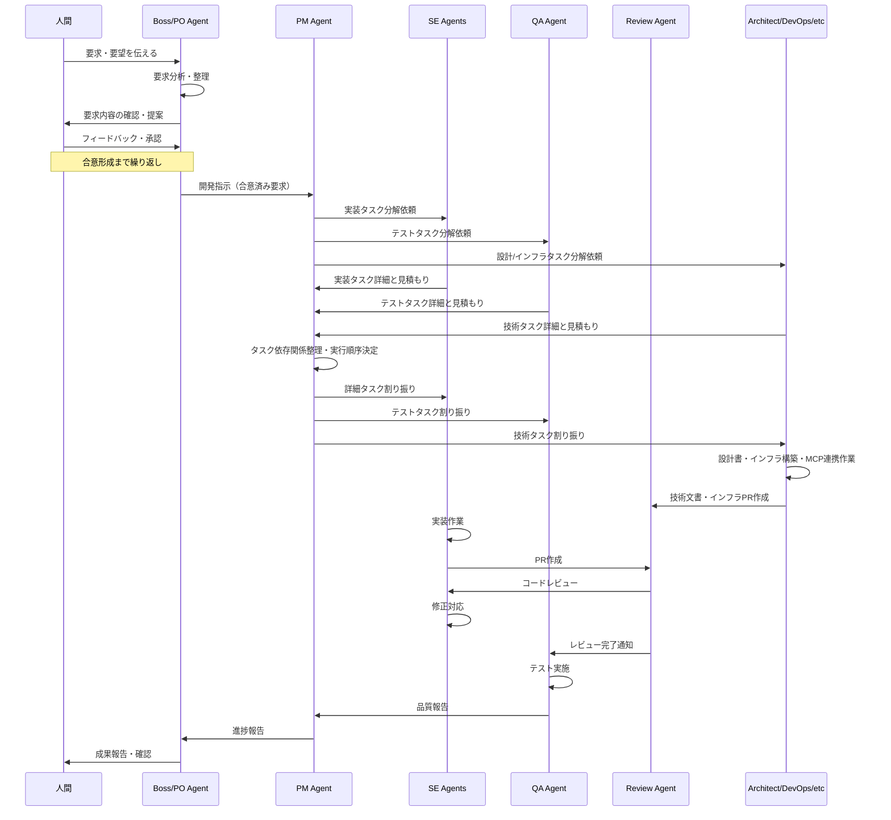

# Operational Concept Description (OCD)
## 複数Claude Codeインスタンスによる非同期協調開発システム

### 1. システムの概要

本システムは、複数のClaude Codeインスタンスにそれぞれ異なるペルソナ（役割）を持たせ、非同期で協調しながらソフトウェア開発を行うシステムである。これにより、人間は企画や課題解決に集中し、実装作業をAIチームに委譲することが可能となる。

### 2. 運用コンセプト

#### 2.1 開発チーム構成

**チーム規模**
- 最小構成：10名のClaude Codeインスタンス
- 最大構成：システムリソースが許す限り拡張可能

**チームメンバーの役割**

| 役割 | 人数 | 主要責任 | 必須スキル |
|------|------|----------|------------|
| チームリーダー/PO（Boss） | 1名 | 人間との対話窓口、要求の整理、チーム全体への指示、最終判断 | リーダーシップ、要求分析、コミュニケーション |
| プロジェクトマネージャー（PM） | 1-2名 | 進捗管理、タスク依存関係管理、優先順位付け、リスク管理 | プロジェクト管理、コミュニケーション |
| ソフトウェアエンジニア（SE） | 4-6名 | 設計・実装・単体テスト | フルスタック開発（フロント・バック・インフラ） |
| UI/UXデザイナー | 1-2名 | 画面設計、UX設計、デザイン指示書作成 | デザイン、フロントエンド実装 |
| テスター/QAエンジニア | 1-2名 | テスト計画、テストケース作成・実施、品質保証 | テスト技法、自動化、フルスタック理解 |
| インフラ/DevOpsエンジニア | 1-2名 | インフラ構築、CI/CD、運用・監視 | クラウド、コンテナ、自動化、フルスタック |
| アーキテクト | 1名 | システム構造設計、技術選定、設計書作成、インフラ構築、MCPサーバー連携 | アーキテクチャ設計、フルスタック、インフラストラクチャ |
| セキュリティエンジニア | 1名 | セキュリティ設計、脆弱性診断 | セキュリティ、フルスタック |
| ビジネスアナリスト | 1名 | 業務要件分析、要件定義支援 | ビジネス分析、技術理解 |

**共通スキル要件**
- 全エンジニアはフルスタック開発能力を保有
- フロントエンド、バックエンド、インフラの基本的な実装が可能

#### 2.2 協調メカニズム

**通信方式**
- 現行：tmuxペイン + send-keysコマンドによる通信
- 通知確認用の共有ディレクトリを使用

**タスク管理方式**
- 基本方針：中央管理型＋専門分散型のハイブリッド
- PMが要求を受けて各専門エージェントにタスク分解を依頼
- 各エージェントが専門知識に基づいてタスクを詳細分解
- ストーリーポイント13未満：そのまま実行
- ストーリーポイント13以上：PMに通達し、再分解を依頼

#### 2.3 開発ワークフロー

**ブランチ戦略**
- git worktreeを活用し、各エージェントがタスク毎の独立したブランチで作業
- 並列開発による効率化を実現

**統合プロセス**
1. 各エージェントがfeatureブランチで開発
2. GitHub MCPを利用してPull Requestを作成
3. 他のエンジニアがコードレビューを実施
4. 人間がdevelop/masterブランチへマージ
5. 各エージェントはGitHub MCPでpullして最新状態を取得

### 3. 期待される効果

#### 3.1 解決される課題
- 人間がソフトウェア開発の実装作業から解放される
- 企画立案や課題解決などの創造的業務に集中可能

#### 3.2 従来方式との比較優位性
- **並列処理による開発速度の向上**
  - 単一Claude Code：逐次的な作業実行
  - 複数Claude Code：並列作業による大幅な速度向上
- **専門性の活用**
  - 各ペルソナが専門領域に特化した判断が可能
- **レビュープロセスの自動化**
  - AI同士によるコードレビューの実現

### 4. 運用シナリオ

#### 4.1 典型的な開発サイクル

#### 4.2 エラー発生時の対応

1. エージェントがエラーを検出
2. PMに通知
3. PMがエラー内容とタスク状況を記録・永続化
4. PMが状況を判断し、適切なエージェントに対応を指示
5. 必要に応じて人間にエスカレーション

### 5. システム要件（概要）

- **実行環境**
  - tmuxによるマルチペイン管理
  - 十分なメモリとCPUリソース
  - 複数Claude Code CLIインスタンスの並列実行環境

- **必須ツール**
  - Git（worktree対応）
  - GitHub MCP
  - 共有ファイルシステム

- **推奨環境**
  - Linux/macOS
  - 16GB以上のRAM
  - マルチコアCPU