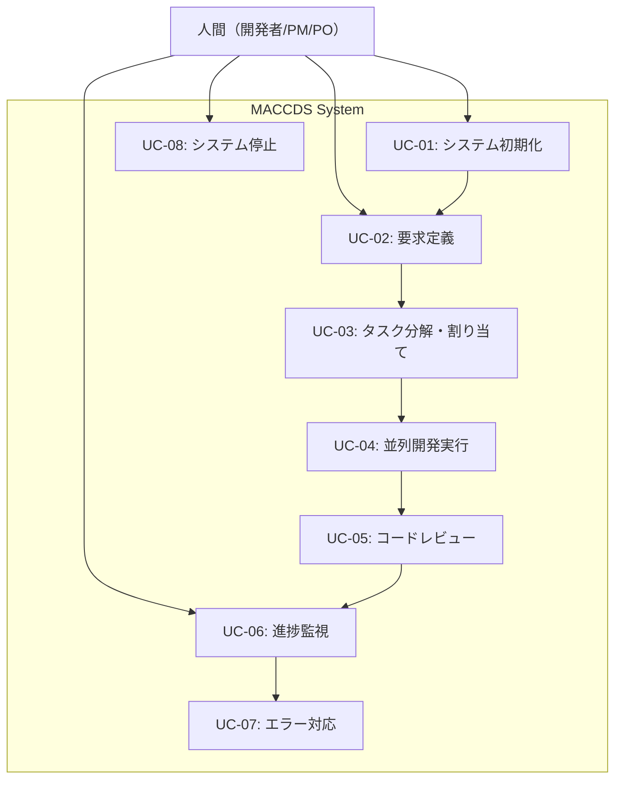

# ユースケース・ユーザーストーリー
## Multi-Agent Claude Code Development System (MACCDS)

## 1. アクター定義

### 1.1 主要アクター
- **人間（Human）**: システムを利用する人間（開発者、プロジェクトマネージャー、プロダクトオーナーの役割を含む）
  - システムとの対話は全てBoss/POエージェント経由で行う

### 1.2 システムアクター
- **Boss/POエージェント**: 人間との対話窓口となるAIエージェント
- **PMエージェント**: プロジェクト管理を行うAIエージェント
- **エンジニアエージェント**: 実装作業を行うAIエージェント
- **QAエージェント**: テスト・品質保証を行うAIエージェント

## 2. ユースケース図

## 3. ユースケース詳細

### UC-01: システム初期化
**アクター**: 人間  
**目的**: AI Multi-Agentシステムを起動し、開発環境を準備する

**事前条件**:
- ai-multi-agentがプロジェクトに配置済み
- 必要なソフトウェア（tmux、Claude Code CLI）がインストール済み

**基本フロー**:
1. 人間がプロジェクトディレクトリに移動
2. `cd ai-multi-agent`を実行
3. `bash start-agents.sh`を実行
4. システムが各エージェントを起動
5. Boss/POエージェントが対話可能状態になる

**代替フロー**:
- 3a. 起動に失敗した場合、エラーメッセージを表示し停止

**事後条件**:
- 全エージェントが稼働状態
- Boss/POエージェントが人間との対話待機中

### UC-02: 要求定義
**アクター**: 人間、Boss/POエージェント  
**目的**: 開発したい機能の要求を定義し、システムに伝達する

**事前条件**:
- システムが初期化済み
- Boss/POエージェントが稼働中

**基本フロー**:
1. 人間がBoss/POエージェントに要求を伝達
2. Boss/POエージェントが要求を分析・整理
3. Boss/POエージェントが確認・提案を返す
4. 人間がフィードバック・承認を行う
5. 合意が形成されるまで3-4を繰り返し
6. Boss/POエージェントがPMエージェントに開発指示

**代替フロー**:
- 4a. 要求が不明確な場合、Boss/POが詳細確認を要求
- 6a. 技術的に実現困難な場合、代替案を提案

**事後条件**:
- 開発要求が明確化・合意済み
- PMエージェントが開発指示を受領

### UC-03: タスク分解・割り当て
**アクター**: PMエージェント、各専門エージェント  
**目的**: 開発要求を実行可能なタスクに分解し、適切なエージェントに割り当てる

**事前条件**:
- 開発要求が明確化済み
- 各専門エージェントが稼働中

**基本フロー**:
1. PMエージェントが各専門エージェントにタスク分解を依頼
2. エンジニアエージェントが実装タスクを詳細分解
3. QAエージェントがテストタスクを詳細分解
4. アーキテクトエージェントが設計タスクを詳細分解
5. 各エージェントがタスク詳細と見積もりをPMに回答
6. PMエージェントがタスク依存関係を整理
7. PMエージェントが実行優先順位を決定
8. PMエージェントが各エージェントにタスクを割り当て

**代替フロー**:
- 2-4a. 13ポイント以上のタスクがある場合、さらに分割
- 6a. 依存関係に循環がある場合、タスク再設計

**事後条件**:
- 全タスクが実行可能サイズに分解済み
- 各エージェントにタスクが割り当て済み

### UC-04: 並列開発実行
**アクター**: エンジニアエージェント、QAエージェント、その他専門エージェント  
**目的**: 割り当てられたタスクを並列で実行し、成果物を作成する

**事前条件**:
- タスクが各エージェントに割り当て済み
- git worktreeが利用可能

**基本フロー**:
1. 各エージェントがタスク毎の独立したブランチで作業開始
2. エンジニアエージェントが実装作業を実行
3. QAエージェントがテスト作業を実行
4. 他の専門エージェントが各自の作業を実行
5. 作業完了後、各エージェントがPull Requestを作成
6. GitHub MCPを通じてPRが登録される

**代替フロー**:
- 2-4a. 作業中にエラーが発生した場合、UC-07へ
- 5a. PR作成に失敗した場合、エラー報告

**事後条件**:
- 各タスクの成果物が完成
- Pull Requestが作成済み

### UC-05: コードレビュー
**アクター**: レビューエージェント、エンジニアエージェント  
**目的**: 作成されたコードの品質を確認し、必要に応じて修正を行う

**事前条件**:
- Pull Requestが作成済み
- レビューエージェントが稼働中

**基本フロー**:
1. レビューエージェントがPRを確認
2. コード品質、設計、テスト網羅性をチェック
3. レビューコメントを作成
4. エンジニアエージェントがコメントを確認
5. 必要に応じて修正を実施
6. レビュー承認後、QAエージェントに通知

**代替フロー**:
- 3a. 重大な問題がある場合、PMエージェントに報告
- 5a. 修正が複雑な場合、タスクを再分割

**事後条件**:
- コードが品質基準を満たす
- QAエージェントがテスト実施準備完了

### UC-06: 進捗監視
**アクター**: 人間、PMエージェント、Boss/POエージェント  
**目的**: プロジェクトの進捗状況を監視し、人間に報告する

**事前条件**:
- 開発作業が進行中
- 各エージェントが稼働中

**基本フロー**:
1. PMエージェントが各エージェントの進捗を収集
2. 全体の進捗状況を分析
3. Boss/POエージェントに進捗を報告
4. Boss/POエージェントが人間に成果を報告
5. 人間が確認・承認

**代替フロー**:
- 2a. 進捗遅延が発生している場合、原因分析
- 4a. 重要な問題がある場合、即座に人間に報告

**事後条件**:
- 進捗状況が人間に共有済み
- 必要に応じて対策が検討される

### UC-07: エラー対応
**アクター**: 各エージェント、PMエージェント  
**目的**: システムで発生したエラーに対応し、作業を継続する

**事前条件**:
- システムが稼働中
- エラーが発生

**基本フロー**:
1. エージェントがエラーを検出
2. PMエージェントに通知
3. PMエージェントがエラー内容とタスク状況を記録
4. PMエージェントが状況を判断
5. 適切なエージェントに対応を指示
6. 問題が解決されるまで対応を継続

**代替フロー**:
- 4a. 自動対応できない場合、人間にエスカレーション
- 5a. エージェント再起動が必要な場合、復旧処理実行

**事後条件**:
- エラーが解決済み
- 作業が正常に継続

### UC-08: システム停止
**アクター**: 人間  
**目的**: AI Multi-Agentシステムを安全に停止する

**事前条件**:
- システムが稼働中

**基本フロー**:
1. 人間が`bash stop-agents.sh`を実行
2. システムが各エージェントの作業状況を確認
3. 実行中のタスクを安全に中断
4. タスク状態を保存
5. 各エージェントを順次停止
6. tmuxセッションを終了

**代替フロー**:
- 3a. 重要な作業中の場合、完了を待機
- 4a. 保存に失敗した場合、警告を表示

**事後条件**:
- 全エージェントが停止済み
- 作業状態が保存済み

## 4. ユーザーストーリー

### Epic 1: システム環境構築

#### US-001: 簡単なセットアップ
**As a** 人間（開発者として）  
**I want to** 簡単なコマンドでAI Multi-Agentシステムをセットアップできる  
**So that** 複雑な設定なしにすぐに開発を開始できる

**受入基準**:
- git cloneと2-3のコマンドでセットアップ完了
- 30分以内にシステムが利用可能になる
- エラーが発生した場合、明確なメッセージが表示される

#### US-002: 設定のカスタマイズ
**As a** 人間（開発者として）  
**I want to** プロジェクトに応じてエージェント構成を変更できる  
**So that** プロジェクトの特性に最適な開発チームを構築できる

**受入基準**:
- YAMLファイルの編集でエージェント構成を変更可能
- エージェント数やスキルセットを柔軟に設定可能
- 設定変更後、即座に反映される

### Epic 2: 要求管理

#### US-003: 自然言語での要求入力
**As a** 人間（プロダクトオーナーとして）  
**I want to** 自然言語で要求をシステムに伝えられる  
**So that** 技術的な詳細を知らなくても開発を依頼できる

**受入基準**:
- 日本語での要求入力が可能
- 曖昧な要求でも適切に質問される
- 要求が正しく理解されたか確認できる

#### US-004: 要求の段階的明確化
**As a** 人間（プロダクトオーナーとして）  
**I want to** 要求を対話的に明確化できる  
**So that** 最初から完璧な仕様を用意しなくても開発を進められる

**受入基準**:
- システムが不明点を質問してくる
- 段階的に詳細を決められる
- いつでも要求を変更・追加できる

### Epic 3: 開発プロセス

#### US-005: 並列開発の自動実行
**As a** 人間（開発者として）  
**I want to** 複数のAIエージェントが自動的に並列開発を行う  
**So that** 手動での作業分担や調整なしに高速開発できる

**受入基準**:
- 10個以上のエージェントが同時に作業
- 作業の重複や競合が発生しない
- 単独開発比6倍以上の速度向上

#### US-006: 自動コードレビュー
**As a** 人間（開発者として）  
**I want to** AIエージェント同士でコードレビューが行われる  
**So that** 人手でのレビュー工数を削減しつつ品質を確保できる

**受入基準**:
- 全てのコードが自動的にレビューされる
- レビューコメントが適切で有用
- 重大な問題は人間に報告される

### Epic 4: 監視・制御

#### US-007: リアルタイム進捗監視
**As a** 人間（プロジェクトマネージャーとして）  
**I want to** 開発の進捗をリアルタイムで確認できる  
**So that** プロジェクトの状況を常に把握し、適切に管理できる

**受入基準**:
- tmux画面で全エージェントの状況を確認可能
- 進捗の遅れやエラーが即座に分かる
- 全体の完了見込み時間が表示される

#### US-008: 簡単な停止・再開
**As a** 人間（開発者として）  
**I want to** システムを簡単に停止・再開できる  
**So that** 必要に応じて作業を中断・継続できる

**受入基準**:
- 1つのコマンドで安全に停止
- 作業状態が保存される
- 再開時に前回の続きから開始される

### Epic 5: エラー処理

#### US-009: 自動エラー回復
**As a** 人間（開発者として）  
**I want to** エラーが発生しても自動的に回復される  
**So that** システムの監視や手動対応の工数を削減できる

**受入基準**:
- エージェントのクラッシュから自動復旧
- 作業データの消失を防止
- 5分以内にシステムが正常状態に復旧

#### US-010: 分かりやすいエラー報告
**As a** 人間（開発者として）  
**I want to** エラーが発生した時に分かりやすい説明を受けられる  
**So that** 迅速に問題を解決できる

**受入基準**:
- エラーの原因が明確に説明される
- 解決方法が提示される
- 必要に応じて人間の介入要求が分かる

## 5. 非機能ユーザーストーリー

### US-011: 高いパフォーマンス
**As a** 人間（開発者として）  
**I want to** システムが高速に動作する  
**So that** 開発効率を最大化できる

**受入基準**:
- タスク割り当てが5秒以内に完了
- エージェント間通信が1秒以内
- システム起動が30秒以内

### US-012: 高い信頼性
**As a** 人間（開発者として）  
**I want to** システムが安定して動作する  
**So that** 開発作業が中断されない

**受入基準**:
- システム稼働率99%以上
- データ消失が発生しない
- 部分的な障害でもシステム継続

### US-013: 簡単な操作
**As a** 人間（開発者として）  
**I want to** 直感的にシステムを操作できる  
**So that** 学習コストを最小化できる

**受入基準**:
- 基本操作を30分で習得可能
- 設定変更が簡単
- ヘルプとドキュメントが充実