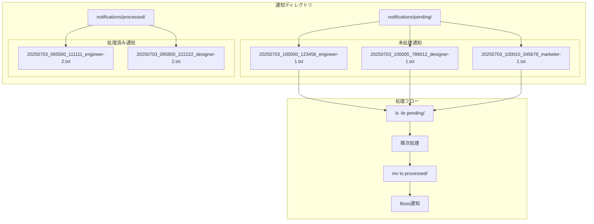

# ディレクトリベース通知システム v2

## 概要

ファイルベースの問題を解決した、ディレクトリベースの通知システムです。各通知を個別ファイルとして作成し、`ls -ltr`で更新順に処理します。

## 改良点

- **IOブロックなし**: ファイルロック不要
- **競合回避不要**: 各通知が独立したファイル
- **処理順序保証**: `ls -ltr`で確実に更新順に処理
- **アトミック操作**: ファイル作成は本質的にアトミック

## システム構成



## ファイル命名規則

```
YYYYMMDD_HHMMSS_NANOSEC_AGENT-NAME.txt
```

例:
- `20250703_143022_123456789_engineer-1.txt`
- `20250703_143025_987654321_designer-1.txt`

## 使用方法

### 1. セットアップ

```bash
./scripts/setup-notification-system-v2.sh
```

### 2. 通知送信

```bash
# エージェントからの通知
./scripts/send-notification-v2.sh engineer-1 "ログイン機能完了"
./scripts/send-notification-v2.sh designer-1 "UI設計完了"
./scripts/send-notification-v2.sh marketer-1 "コンテンツ作成完了"
```

### 3. 通知確認

```bash
# 未処理通知の確認
ls -ltr notifications/pending/

# 処理済み通知の確認
ls -ltr notifications/processed/

# 通知監視の確認
tmux attach -t ai-multi-agent:notification
```

## 処理フロー

### 1. 通知作成

```bash
# send-notification-v2.sh の動作
TIMESTAMP=$(date +%Y%m%d_%H%M%S_%N)
NOTIFICATION_FILE="pending/${TIMESTAMP}_${FROM_AGENT}.txt"
echo "[$FROM_AGENT] $MESSAGE (完了時刻: $NOTIFICATION_TIME)" > "$NOTIFICATION_FILE"
```

### 2. 通知監視

```bash
# notification-watcher-v2.sh の動作
files=($(ls -ltr pending/ 2>/dev/null | awk 'NR>1 {print $NF}'))
for file in "${files[@]}"; do
    message=$(cat "pending/$file")
    send_notification_to_boss "$message"
    mv "pending/$file" "processed/"
done
```

## 優位性

### vs ファイルベース

| 項目 | ファイルベース | ディレクトリベース |
|------|---------------|-------------------|
| 競合回避 | ファイルロック必要 | 不要 |
| IOブロック | 考慮必要 | 不要 |
| 処理順序 | 複雑 | ls -ltr で簡単 |
| 実装複雑度 | 高 | 低 |

### vs データベース

| 項目 | データベース | ディレクトリベース |
|------|--------------|-------------------|
| 依存関係 | DB必要 | ファイルシステムのみ |
| 設定 | 複雑 | 簡単 |
| 可視性 | クエリ必要 | ls コマンドで確認 |
| バックアップ | 専用ツール | 通常のファイル操作 |

## 実装例

### エージェントの作業完了パターン

```bash
#!/bin/bash
# エージェントの作業スクリプト例

# 1. 作業実行
echo "ログイン機能を実装中..."
sleep 30  # 実際の作業時間

# 2. 作業完了通知
./scripts/send-notification-v2.sh engineer-1 "ログイン機能の実装が完了しました"

# 3. 次のタスクがあれば継続
echo "次のタスクを待機中..."
```

### Boss側の処理

```bash
# Boss側では自動的に通知を受信
# 【🔔通知 2025-07-03 14:30:25】[engineer-1] ログイン機能の実装が完了しました (完了時刻: 2025-07-03T14:30:22+09:00)

# 次の指示を出す
./scripts/send-to-pane.sh engineer 1 "次はユーザー管理機能を実装してください"
```

## トラブルシューティング

### 通知が来ない場合

```bash
# 1. 未処理通知の確認
ls -la notifications/pending/

# 2. 監視プロセスの確認
tmux attach -t ai-multi-agent:notification

# 3. 手動テスト
./scripts/send-notification-v2.sh test "テスト通知"
```

### 通知が溜まりすぎた場合

```bash
# 古い処理済み通知の削除
find notifications/processed/ -type f -mtime +7 -delete

# 強制的に全て処理済みにする
mv notifications/pending/* notifications/processed/ 2>/dev/null || true
```

## 拡張アイデア

### 1. 優先度対応

```bash
# 優先度別ディレクトリ
mkdir -p notifications/pending/{high,medium,low}

# 優先度付き送信
./scripts/send-notification-v2.sh engineer-1 "緊急バグ修正完了" high
```

### 2. 通知種別対応

```bash
# 種別別処理
./scripts/send-notification-v2.sh engineer-1 "complete:ログイン機能完了"
./scripts/send-notification-v2.sh engineer-1 "error:テスト失敗"
./scripts/send-notification-v2.sh engineer-1 "question:仕様確認したい"
```

このディレクトリベース方式により、シンプルで確実な通知システムが実現できました！