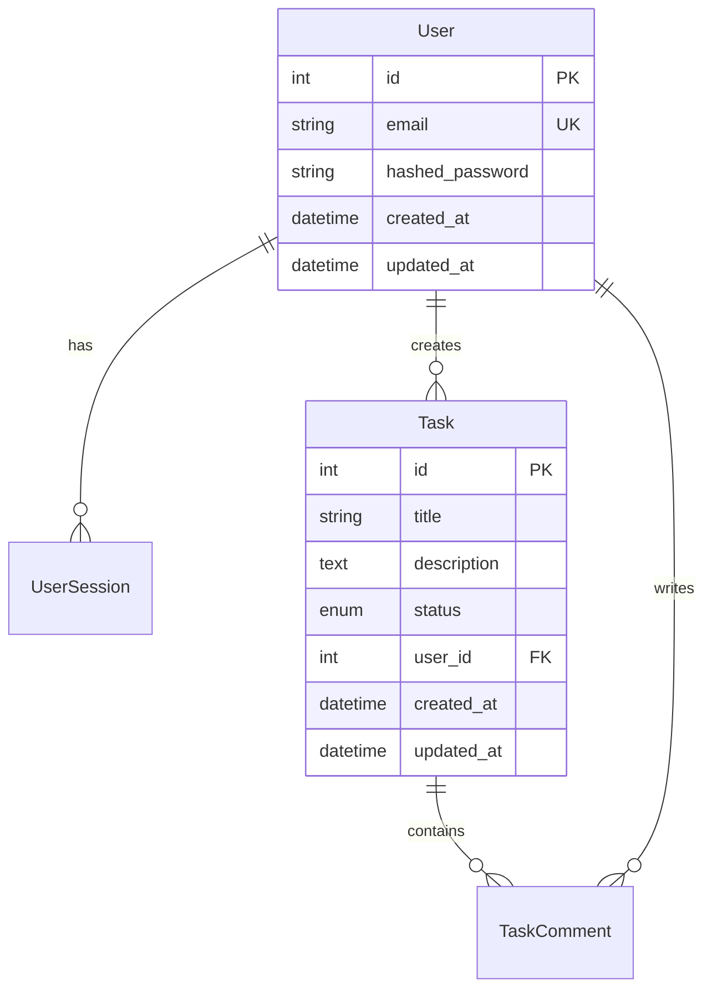

# アーキテクチャ設計書テンプレート

## プロジェクト情報
- **プロジェクト名**: [PROJECT_NAME]
- **作成日**: [DATE]
- **作成者**: [ARCHITECT_NAME]
- **承認者**: [APPROVER_NAME]
- **バージョン**: [VERSION]

## 1. システム概要

### 1.1 システムの目的
[システムが解決する課題と目的を記載]

### 1.2 システムの範囲
[システムが対象とする範囲と境界を明確化]

### 1.3 主要な機能
- [主要機能1]
- [主要機能2]
- [主要機能3]

## 2. アーキテクチャ全体像

### 2.1 システム構成図
```
┌─────────────────┐    ┌─────────────────┐    ┌─────────────────┐
│   Frontend      │    │   Backend API   │    │   Database      │
│   (React/Next)  │◄──►│   (FastAPI)     │◄──►│   (PostgreSQL)  │
└─────────────────┘    └─────────────────┘    └─────────────────┘
         │                       │                       │
         │              ┌─────────────────┐              │
         └──────────────►│  External APIs  │◄─────────────┘
                        └─────────────────┘
```

### 2.2 レイヤー構造
```
┌─────────────────────────────────────────┐
│           Presentation Layer            │
│  (React Components, Pages, Hooks)      │
├─────────────────────────────────────────┤
│            Application Layer            │
│     (API Routes, Business Logic)       │
├─────────────────────────────────────────┤
│             Domain Layer                │
│    (Entities, Services, Repositories)  │
├─────────────────────────────────────────┤
│          Infrastructure Layer           │
│   (Database, External APIs, Storage)   │
└─────────────────────────────────────────┘
```

## 3. 技術選定の詳細

### 3.1 フロントエンド
```yaml
framework: Next.js 14
ui_library: React 18
styling: Tailwind CSS + shadcn/ui
state_management: Zustand / React Query
routing: Next.js App Router
bundler: Turbopack
```

### 3.2 バックエンド
```yaml
framework: FastAPI
language: Python 3.11+
orm: SQLAlchemy 2.0
validation: Pydantic
authentication: JWT + OAuth2
async_runtime: asyncio
api_documentation: OpenAPI/Swagger
```

### 3.3 データベース
```yaml
primary_db: PostgreSQL 15+
cache: Redis
search: PostgreSQL Full-Text Search
migrations: Alembic
connection_pooling: SQLAlchemy Pool
```

### 3.4 インフラ・運用
```yaml
containerization: Docker + Docker Compose
ci_cd: GitHub Actions
monitoring: 
  - Application: OpenTelemetry
  - Infrastructure: Prometheus + Grafana
logging: Structured JSON logs
security: 
  - HTTPS/TLS 1.3
  - CORS configuration
  - Rate limiting
```

## 4. データアーキテクチャ

### 4.1 データモデル概要


### 4.2 データフロー
```
User Input → Validation → Business Logic → Repository → Database
    ↓
Response ← Serialization ← Domain Objects ← Repository ← Database
```

## 5. セキュリティアーキテクチャ

### 5.1 認証・認可
```yaml
authentication:
  - JWT tokens (access + refresh)
  - OAuth2 flow
  - Multi-factor authentication (optional)

authorization:
  - Role-based access control (RBAC)
  - Resource-level permissions
  - API endpoint protection
```

### 5.2 セキュリティ対策
- **入力検証**: Pydantic validators
- **SQLインジェクション対策**: SQLAlchemy ORM + parameterized queries
- **XSS対策**: Content Security Policy
- **CSRF対策**: CSRF tokens
- **暗号化**: bcrypt for passwords, AES for sensitive data
- **通信保護**: TLS 1.3, HSTS headers

## 6. パフォーマンス設計

### 6.1 スケーラビリティ戦略
- **水平スケーリング**: ロードバランサー + 複数インスタンス
- **データベース最適化**: インデックス、クエリ最適化
- **キャッシュ戦略**: Redis for session data, API response caching
- **CDN**: 静的アセットの配信

### 6.2 パフォーマンス目標
```yaml
response_time:
  - API endpoints: < 200ms (95th percentile)
  - Page load: < 2s (First Contentful Paint)
  - Database queries: < 100ms (average)

throughput:
  - Concurrent users: 1000
  - Requests per second: 500

availability:
  - Uptime: 99.9%
  - Recovery time: < 5 minutes
```

## 7. アプリケーション構造

### 7.1 ディレクトリ構造
```
project/
├── frontend/                 # Next.js アプリケーション
│   ├── app/                 # App Router
│   ├── components/          # 再利用可能コンポーネント
│   ├── lib/                # ユーティリティ・設定
│   └── types/              # TypeScript型定義
├── backend/                 # FastAPI アプリケーション
│   ├── app/
│   │   ├── api/            # APIルート
│   │   ├── core/           # 設定・セキュリティ
│   │   ├── domain/         # ドメインモデル
│   │   ├── infrastructure/ # データアクセス
│   │   └── services/       # ビジネスロジック
│   └── tests/              # テストコード
└── infrastructure/         # Docker, CI/CD
```

### 7.2 コンポーネント間通信
```yaml
frontend_to_backend:
  - HTTP/HTTPS REST API
  - WebSocket (リアルタイム機能)
  - JSON data format

backend_to_database:
  - SQLAlchemy ORM
  - Connection pooling
  - Transaction management

backend_to_external:
  - HTTP clients (httpx)
  - API rate limiting
  - Circuit breaker pattern
```

## 8. エラーハンドリング戦略

### 8.1 エラー分類
```yaml
client_errors:
  - 400: Bad Request (バリデーションエラー)
  - 401: Unauthorized (認証エラー)
  - 403: Forbidden (認可エラー)
  - 404: Not Found (リソース未発見)

server_errors:
  - 500: Internal Server Error (予期しないエラー)
  - 502: Bad Gateway (外部API接続エラー)
  - 503: Service Unavailable (メンテナンス)
```

### 8.2 エラー処理フロー
```
Error Occurs → Log Error → Return Appropriate Response → Monitor/Alert
```

## 9. 監視・ログ戦略

### 9.1 ログ設計
```json
{
  "timestamp": "2024-01-15T10:30:00Z",
  "level": "INFO",
  "service": "backend-api",
  "trace_id": "abc123",
  "user_id": "user123",
  "endpoint": "/api/v1/tasks",
  "method": "POST",
  "status_code": 201,
  "duration_ms": 150,
  "message": "Task created successfully"
}
```

### 9.2 メトリクス
- **ビジネスメトリクス**: ユーザー登録数、タスク作成数
- **技術メトリクス**: レスポンス時間、エラー率、CPU/メモリ使用率
- **SLIメトリクス**: 可用性、レイテンシ、スループット

## 10. デプロイメント戦略

### 10.1 環境構成
```yaml
development:
  - Local Docker Compose
  - Hot reload enabled
  - Debug mode

staging:
  - Production-like environment
  - Integration testing
  - Performance testing

production:
  - Blue-Green deployment
  - Health checks
  - Rollback capability
```

### 10.2 CI/CDパイプライン
```yaml
pipeline_stages:
  1. Code commit
  2. Automated tests (unit, integration)
  3. Security scanning
  4. Build Docker images
  5. Deploy to staging
  6. E2E tests
  7. Deploy to production (approval required)
  8. Health check & monitoring
```

## 11. 技術的制約と前提

### 11.1 制約事項
- 予算制限: [BUDGET_CONSTRAINT]
- 開発期間: [TIME_CONSTRAINT]
- チームスキル: [SKILL_CONSTRAINT]
- レガシーシステム連携: [LEGACY_CONSTRAINT]

### 11.2 前提条件
- インターネット接続が必要
- モダンブラウザ対応（Chrome, Firefox, Safari, Edge）
- モバイルレスポンシブ対応

## 12. 今後の拡張性

### 12.1 想定される拡張
- マイクロサービス化
- 多言語対応（i18n）
- 外部システム連携API追加
- モバイルアプリ開発

### 12.2 アーキテクチャ進化パス
```
Phase 1: Monolithic → Phase 2: Modular Monolith → Phase 3: Microservices
```

## 承認記録

| 項目 | 承認者 | 承認日 | コメント |
|------|--------|--------|----------|
| アーキテクチャ全体 | [APPROVER] | [DATE] | [COMMENTS] |
| セキュリティ設計 | [SECURITY_APPROVER] | [DATE] | [COMMENTS] |
| パフォーマンス設計 | [PERFORMANCE_APPROVER] | [DATE] | [COMMENTS] |